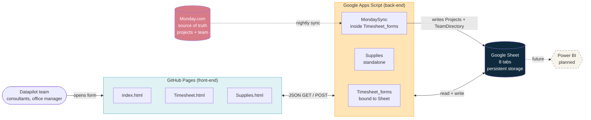

# Datapilot Internal Forms

A lightweight set of internal forms for Datapilot's team, replacing manual timesheet tracking and ad-hoc supplies requests with a few simple browser-based forms that write everything into a single Google Sheet.

The two main forms are a weekly timesheet (where consultants log billable, non-billable, and time-off hours, plus heads-up for next week's WFH and leave) and an office supplies request form (where anyone can request office items, with status updates emailed back as the office manager handles them). A small landing page at the root links to both.

Everything is hosted on GitHub Pages for the front-end, with Google Apps Script as the back-end and Google Sheets as the database. There is no server to maintain, no cloud bill, and no separate deployment pipeline. Changes go live through a Git commit (for HTML) or a redeploy from within the Apps Script editor (for the server-side logic).

## Quick links

For a non-technical walkthrough of how to operate the system day-to-day, including adding a new project on Monday, editing the FAQ, handling a team member joining or leaving, and what to do when something seems broken, see the Operations Manual document maintained alongside this repository.

For the full technical handover, see the Technical Handover document. It covers architecture diagrams, the complete data flow for both form submissions and the daily Monday sync, deployment workflow, ownership transfers, every gotcha encountered during the build, and a troubleshooting playbook. This is the right place to start if you are picking up this project as a developer and need to understand or extend any part of it.

## Architecture at a glance

The picture above is rendered natively by GitHub when you view this README on the web. The same architecture is shown with much more detail and additional flow diagrams inside the Technical Handover document. If you are reading this on a tool that does not render Mermaid, the diagram is also available as a static image in the Technical Handover.

## Live forms

The forms are currently served from the personal GitHub Pages site of the original developer at `https://nevaj-datapilot.github.io/Datapilot-Forms/`. Once the repository transfer to the Datapilot GitHub organization is complete and the new maintainer has been granted Maintain access (necessary for configuring GitHub Pages on the new location), the URL will move to the organization's GitHub Pages domain. Update this section once that migration happens.

The three pages are an index landing page at the root, the weekly timesheet at `/Timesheet.html`, and the office supplies request form at `/Supplies.html`.

## Repository contents

This repository contains only the front-end HTML files and brand assets. The server-side Apps Script code lives separately inside Google Drive, bound to the shared Google Sheet, and is not version-controlled in this repo. Copies of the Apps Script files are included here under an `apps-script/` directory for reference and reading, but editing those files in this repository does not change the deployed back-end. To change the back-end, you must edit the script project directly in the Google Apps Script editor.

The HTML files in this repository are `index.html` (landing page with cards linking to each form), `Timesheet.html` (weekly timesheet form), and `Supplies.html` (office supplies request form). They share a common visual language and brand styling but are otherwise independent.

The `brand-elements/` folder contains decorative PNG assets that the forms reference, along with the Datapilot logo and favicon image.

## How a deploy works

For a front-end change (HTML, CSS, or client-side JavaScript inside one of the form files), edit the relevant `.html` file in this repository, commit and push to the main branch, and GitHub Pages will pick up the change within roughly one minute. Users should hard-refresh their browser (Ctrl+F5 on Windows, Cmd+Shift+R on Mac) to bypass cached versions of the page.

For a back-end change (Apps Script logic, email templates, sync behavior, or anything in the `.gs` files), open the relevant Apps Script project in your browser, paste in the new code, save with Ctrl+S, and then redeploy the Web App through Deploy > Manage deployments > pencil icon > New version > Deploy. The deployment URL stays stable across redeploys, so no front-end changes are needed when only the back-end changes. Detailed steps are in the Technical Handover document.

## The pieces, briefly

The complete system consists of three GitHub-hosted HTML files, two separate Google Apps Script projects (one for the timesheet which is bound to the Google Sheet, and one standalone project for the supplies form), one Monday-to-Sheet sync script that runs daily, and one shared Google Sheet that holds everything. Monday.com is treated as the upstream source of truth for projects and team members. These flow into the Sheet automatically every night through the sync script, and the timesheet form reads from the Sheet to populate its project dropdown and ad-hoc section.

The shared Google Sheet has several tabs serving different purposes. The `Consolidated` tab is where every submitted timesheet entry ends up, one row per entry. The `Projects` tab is populated automatically from Monday and read by the form. The `TeamDirectory` tab is also synced from Monday and provides the team email dropdown. The `NextWeekPlanning` tab mirrors the heads-up section of each timesheet submission for easier weekly reporting. The `SuppliesRequests` tab receives supplies form submissions, with editable status columns that trigger automatic status update emails to the requester. The `AdHocExamples` and `FAQ` tabs hold content that the timesheet form fetches and displays inline. All other technical details, including the relationships between tabs and the column schemas, are in the Technical Handover.

## Maintainer

The original developer of this system is Nevaj Sunnassy at Datapilot. Going forward, ownership of the Google Sheet, both Apps Script projects, and this GitHub repository should rest with a stable Datapilot account (currently `consultant@datapilot.fr`) so that the system survives any individual leaving the company. The Technical Handover document includes a checklist for completing this transfer and verifying all the moving parts still work afterward.

## Status

The system is live and in active use. The timesheet form is deployed and being used by the team weekly. The supplies form is deployed and working. The Monday sync runs daily under the original developer's account and needs to be re-created under a stable account as part of the ownership transfer. A Power BI dashboard reading from the `Consolidated` and `Projects` tabs is planned but not yet built.
